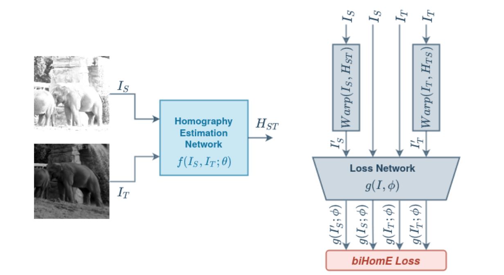

# Perceptual Loss for Robust Unsupervised Homography Estimation


This is the official code for the CVPR'21 IMW Paper "[Perceptual Loss for Robust Unsupervised Homography Estimation](https://openaccess.thecvf.com/content/CVPR2021W/IMW/html/Koguciuk_Perceptual_Loss_for_Robust_Unsupervised_Homography_Estimation_CVPRW_2021_paper.html)" by [Daniel Koguciuk](https://linkedin.com/in/danielkoguciuk), [Elahe Arani](https://www.linkedin.com/in/elahe-arani-630870b2/), and [Bahram Zonooz](https://scholar.google.com/citations?hl=en&user=FZmIlY8AAAAJ).

#### Abstract

Homography estimation is often an indispensable step in many computer vision tasks. The existing approaches, however, are not robust to illumination and/or larger viewpoint changes. In this paper, we propose bidirectional implicit Homography Estimation (biHomE) loss for unsupervised homography estimation. biHomE minimizes the distance in the feature space between the warped image from the source viewpoint and the corresponding image from the target viewpoint. Since we use a fixed pre-trained feature extractor and the only learnable component of our framework is the homography network, we effectively decouple the homography estimation from representation learning. We use an additional photometric distortion step in the synthetic COCO dataset generation to better represent the illumination variation of the real-world scenarios. We show that biHomE achieves state-of-the-art performance on synthetic COCO dataset, which is also comparable or better compared to supervised approaches. Furthermore, the empirical results demonstrate the robustness of our approach to illumination variation compared to existing methods.



For details, please see the [Paper](https://openaccess.thecvf.com/content/CVPR2021W/IMW/html/Koguciuk_Perceptual_Loss_for_Robust_Unsupervised_Homography_Estimation_CVPRW_2021_paper.html) and [Presentation](https://www.youtube.com/watch?v=X6aRM2ctxXI&ab_channel=NeurAI).

#### Environment setup

```
python3 -m venv venv
source venv/bin/activate
pip3 install --upgrade pip
pip3 install -r requirements.txt
```

#### Dataset preparation

To speed up training we can take some part of the data preparation process offline:

```
python3 src/data/coco/preprocess_offline.py --raw_dataset_root /data/input/datasets/COCO/train2014 --output_dataset_root /data/input/datasets/ImageRegistration/coco/train2014
python3 src/data/coco/preprocess_offline.py --raw_dataset_root /data/input/datasets/COCO/val2014 --output_dataset_root /data/input/datasets/ImageRegistration/coco/val2014
ln -s /data/input/datasets/ImageRegistration/coco data/coco/dataset
```

#### Training

```
python3 train.py --config_file config/pds-coco/zeng-bihome-lr-1e-3.yaml
```

#### Testing

```
python3 eval.py --config_file config/pds-coco/zeng-bihome-lr-1e-3.yaml --ckpt log/zeng-bihome-pdscoco-lr-1e-3/model_90000.pth
```

#### Cite our work:
<pre>
@inproceedings{koguciuk2021perceptual,
  title={Perceptual Loss for Robust Unsupervised Homography Estimation},
  author={Koguciuk, Daniel and Arani, Elahe and Zonooz, Bahram},
  booktitle={Proceedings of the IEEE/CVF Conference on Computer Vision and Pattern Recognition},
  pages={4274--4283},
  year={2021}
}
</pre>

#### License
This project is licensed under the terms of the MIT license.
